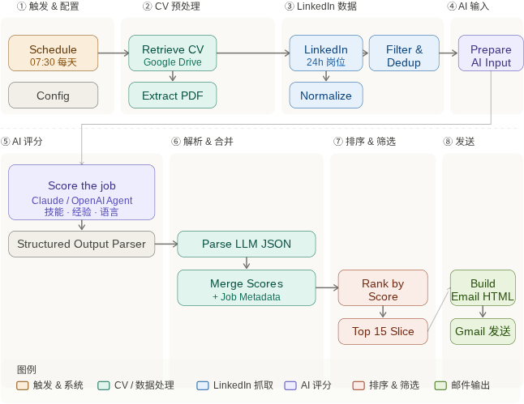
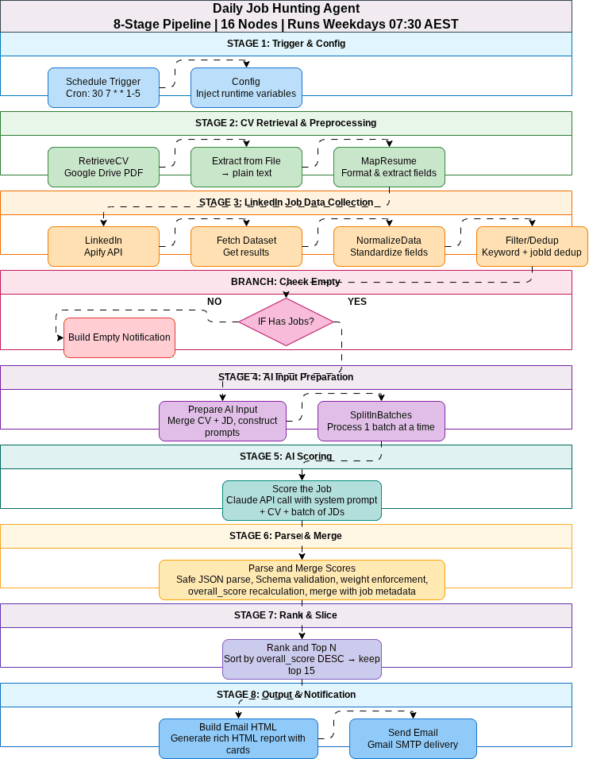

<div align="center">

# 🎯 Daily Job Hunting Agent — Australia

**[English](./README.md) · [中文](./README_CN.md)**

</div>

<div align="center">

<!-- Tech Stack Badges -->
[ [ [ [ [ [

</div>

> Automated daily job search and AI-powered matching system for the Australian job market.

An n8n workflow that automatically searches LinkedIn for new job postings every weekday morning, scores each one against your CV using Claude AI across 5 evaluation dimensions, and delivers a beautifully formatted HTML email report with the top 15 best-matching opportunities.

---

## 📋 Table of Contents

- [Architecture Overview](#architecture-overview)
- [Required Accounts](#required-accounts)
- [Estimated Running Costs](#estimated-running-costs)
- [Deployment Steps (10 Steps)](#deployment-steps-10-steps)
- [Config Node Variables Reference](#config-node-variables-reference)
- [Scoring Schema](#scoring-schema)
- [Project Structure](#project-structure)
- [FAQ & Troubleshooting](#faq--troubleshooting)
- [Customization Guide](#customization-guide)
- [Disclaimer](#disclaimer)
- [License](#license)

---

## Architecture Overview

The workflow follows an 8-stage, 16-node pipeline that runs every weekday at 07:30 AEST.

---

### System Architecture

<div align="center">



</div>

---

### Pipeline Flow

<div align="center">



*End-to-end data flow: from schedule trigger to Gmail delivery*

</div>

> **Stage guide:** ① Trigger & Config → ② CV Preprocessing → ③ LinkedIn Data → ④ AI Input → ⑤ AI Scoring → ⑥ Parse & Merge → ⑦ Rank & Slice → ⑧ Send Email

---

## Required Accounts

Before starting deployment, ensure you have accounts with the following services:

| # | Service | Purpose | Free Tier Available | Sign Up Link |
|---|---------|---------|---------------------|--------------|
| 1 | **n8n** | Workflow automation engine | ✅ Self-hosted is free; Cloud from $20/mo | [n8n.io](https://n8n.io) |
| 2 | **Apify** | LinkedIn job scraping via `bebity/linkedin-jobs-scraper` | ✅ $5/mo free credits | [apify.com](https://apify.com) |
| 3 | **Google Cloud** | Google Drive API (CV retrieval) + Gmail API (email sending) | ✅ Free tier covers usage | [console.cloud.google.com](https://console.cloud.google.com) |
| 4 | **Anthropic** | Claude AI API for job-CV scoring | ❌ Pay-per-use (~$0.15/run) | [platform.claude.com](https://platform.claude.com/) |

---

## Estimated Running Costs

| Component | Cost per Run | Monthly (22 workdays) |
|-----------|-------------|----------------------|
| Apify (100 jobs scraped) | ~$0.05 – $0.10 | ~$1.10 – $2.20 |
| Claude API (scoring ~50 jobs) | ~$0.10 – $0.20 | ~$2.20 – $4.40 |
| Google APIs | Free | Free |
| n8n (self-hosted) | Free | Free |
| **Total** | **~$0.15 – $0.30** | **~$3.30 – $6.60** |

---

## Deployment Steps (10 Steps)

### Step 1: Install and Start n8n

Choose one of the following installation methods:

**Option A — Docker (Recommended)**

```bash
docker run -d \
  --name n8n \
  --restart unless-stopped \
  -p 5678:5678 \
  -e GENERIC_TIMEZONE=Australia/Sydney \
  -e TZ=Australia/Sydney \
  -v n8n_data:/home/node/.n8n \
  n8nio/n8n
```

**Option B — npm Global Install**

```bash
npm install -g n8n
export GENERIC_TIMEZONE=Australia/Sydney
n8n start
```

**Option C — n8n Cloud**

Sign up at [app.n8n.cloud](https://app.n8n.cloud) — no installation required.

After starting, access the n8n editor at `http://localhost:5678` (or your cloud URL).

---

### Step 2: Set Up Google Cloud Project & APIs

1. Go to [Google Cloud Console](https://console.cloud.google.com)
2. Click **Select a Project** → **New Project**
   - Project name: `job-agent` (or any name you prefer)
3. Navigate to **APIs & Services → Library**
4. Search for and **Enable** the following APIs:
   - **Google Drive API**
   - **Gmail API**
5. Navigate to **APIs & Services → Credentials**
6. Click **+ CREATE CREDENTIALS** → **OAuth 2.0 Client ID**
   - Application type: **Web application**
   - Name: `n8n Job Agent`
   - Authorized redirect URIs: add `http://localhost:5678/rest/oauth2-credential/callback`
     (replace with your actual n8n URL if hosted remotely)
7. Click **Create** and note down your **Client ID** and **Client Secret**
8. Navigate to **OAuth consent screen**
   - User type: **External** (or Internal if using Google Workspace)
   - Fill in required fields (app name, user support email)
   - Add scopes: `https://www.googleapis.com/auth/drive.readonly` and `https://mail.google.com/`
   - Add your email as a test user (while app is in testing mode)

---

### Step 3: Set Up Apify Account & Actor

1. Sign up at [apify.com](https://apify.com)
2. Go to **Account → Settings → Integrations**
3. Copy your **Personal API Token** and save it securely
4. Go to the Apify Store and find **bebity/linkedin-jobs-scraper**
   - URL: [https://apify.com/bebity/linkedin-jobs-scraper](https://apify.com/bebity/linkedin-jobs-scraper)
5. Click **Try for free** to add it to your actors
6. Verify you have sufficient credits ($5 free tier should cover initial testing)

---

### Step 4: Get Anthropic Claude API Key

1. Sign up at [platform.claude.com/](https://platform.claude.com/)
2. Navigate to **Settings → API Keys**
3. Click **Create Key**
   - Name: `n8n-job-agent`
4. Copy the API key (starts with `sk-ant-api03-...`) and save it securely
5. Navigate to **Settings → Billing**
   - Add a payment method
   - Recommended: set a monthly spending limit (e.g., $10)

---

### Step 5: Upload Your CV to Google Drive

1. Ensure your CV/Resume is in **text-based PDF format**
   - ✅ Exported from Word, Google Docs, or LaTeX
   - ❌ Scanned image PDF will NOT work (text cannot be extracted)
2. Upload the PDF to your Google Drive
3. Right-click the file → **Share** → **General access** → **Anyone with the link** (Viewer)
   - Alternatively, share it specifically with the Google service account email
4. Copy the **File ID** from the URL:
   ```
   https://drive.google.com/file/d/[THIS_IS_YOUR_FILE_ID]/view
   ```
   Example: if URL is `https://drive.google.com/file/d/1aBcDeFgHiJkLmNoPqR/view`,
   then File ID is `1aBcDeFgHiJkLmNoPqR`

---

### Step 6: Configure n8n Credentials

In the n8n editor, go to **☰ Menu → Credentials** and create the following four credentials:

#### 6a. Google Drive OAuth2

| Field | Value |
|-------|-------|
| **Credential Type** | Google Drive OAuth2 API |
| **Client ID** | _(from Step 2)_ |
| **Client Secret** | _(from Step 2)_ |

Click **Sign in with Google** and complete the OAuth authorization flow.

#### 6b. Gmail OAuth2

| Field | Value |
|-------|-------|
| **Credential Type** | Gmail OAuth2 API |
| **Client ID** | _(same as Step 2)_ |
| **Client Secret** | _(same as Step 2)_ |

Click **Sign in with Google** and authorize Gmail access.

#### 6c. Apify API Token

| Field | Value |
|-------|-------|
| **Credential Type** | Header Auth |
| **Name** | `Authorization` |
| **Value** | `Bearer YOUR_APIFY_API_TOKEN` |

Replace `YOUR_APIFY_API_TOKEN` with the token from Step 3.

#### 6d. Claude API Key

| Field | Value |
|-------|-------|
| **Credential Type** | Header Auth |
| **Name** | `x-api-key` |
| **Value** | `YOUR_CLAUDE_API_KEY` |

Replace `YOUR_CLAUDE_API_KEY` with the key from Step 4.

---

### Step 7: Import the Workflow

1. In the n8n editor, click **☰ Menu → Import from File**
2. Select the file `workflow/job_agent.json` from this project
3. The workflow will open with all 16+ nodes and connections pre-configured
4. Verify the workflow layout appears correct (nodes should flow left-to-right)

---

### Step 8: Update the Config Node Variables

1. Double-click the **Config** node (second node in the workflow)
2. Edit the JSON output to match your settings:

```json
{
  "GOOGLE_DRIVE_FILE_ID": "YOUR_ACTUAL_FILE_ID_FROM_STEP_5",
  "LINKEDIN_SEARCH_KEYWORDS": "Software Engineer,Backend Developer,Full Stack Developer",
  "LINKEDIN_LOCATION": "Australia",
  "RECIPIENT_EMAIL": "your.actual.email@gmail.com",
  "TOP_N_JOBS": 15,
  "AI_BATCH_SIZE": 5,
  "MIN_OVERALL_SCORE": 0,
  "EXCLUDE_KEYWORDS": "intern,junior,graduate,trainee"
}
```

Adjust the search keywords and exclude keywords to match your target roles.

---

### Step 9: Link Credentials to Nodes

Double-click each of the following nodes and select the correct credential from the dropdown:

| Node Name | Credential to Select |
|-----------|---------------------|
| **RetrieveCV** | Google Drive OAuth2 |
| **LinkedIn** | Apify API Token (Header Auth) |
| **Fetch Dataset** | Apify API Token (Header Auth) |
| **Score the Job** | Claude API Key (Header Auth) |
| **Send Email** | Gmail OAuth2 |
| **Send Empty Notification** | Gmail OAuth2 |

---

### Step 10: Test and Activate

1. **Manual Test Run**
   - Click the **Execute Workflow** button (▶️) in the top toolbar
   - Wait for the workflow to complete (typically 2–5 minutes)
   - Click on each node to inspect its output data
   - Verify the output at each stage:
     - `RetrieveCV`: should show binary PDF data
     - `Extract from File`: should show extracted text
     - `LinkedIn`: should show Apify run response
     - `NormalizeData`: should show standardized job objects
     - `Score the Job`: should show Claude API response
     - `Build Email HTML`: should show HTML string
     - `Send Email`: should show success confirmation

2. **Check Your Inbox**
   - You should receive the daily job report email
   - Verify the email renders correctly (scores, progress bars, buttons)

3. **Activate the Workflow**
   - Toggle the **Active** switch in the top-right corner to **ON**
   - The workflow will now run automatically every weekday at 07:30 AEST

4. **Monitor Executions**
   - Go to **☰ Menu → Executions** to view past runs
   - Failed executions will show error details for debugging

---

## Config Node Variables Reference

| Variable | Type | Default | Description |
|----------|------|---------|-------------|
| `GOOGLE_DRIVE_FILE_ID` | string | — | Your CV PDF file's Google Drive File ID |
| `LINKEDIN_SEARCH_KEYWORDS` | string | — | Comma-separated search keywords (e.g., `"Software Engineer,Backend Developer"`) |
| `LINKEDIN_LOCATION` | string | `"Australia"` | Geographic search region |
| `RECIPIENT_EMAIL` | string | — | Email address to receive the daily report |
| `TOP_N_JOBS` | number | `15` | Number of top-scoring jobs to include in the report |
| `AI_BATCH_SIZE` | number | `5` | Number of jobs per AI scoring API call (3–5 recommended) |
| `MIN_OVERALL_SCORE` | number | `0` | Minimum score threshold (jobs below this are excluded from the report) |
| `EXCLUDE_KEYWORDS` | string | `""` | Comma-separated keywords to exclude (matched against job title) |

---

## Scoring Schema

Each job is evaluated across 5 weighted dimensions:

| Dimension | Weight | What It Measures |
|-----------|--------|-----------------|
| `technical_skills_match` | 35% | Tech stack, tools, certifications vs. CV skills |
| `experience_level_match` | 25% | Years of experience, seniority, role complexity |
| `language_requirements` | 15% | English proficiency, additional language needs |
| `industry_domain_fit` | 15% | Industry background relevance to the target role |
| `location_visa_compatibility` | 10% | Work rights, location, remote/hybrid compatibility |

**Overall Score Formula:**

```
overall_score = (technical × 0.35) + (experience × 0.25) + (language × 0.15) 
              + (industry × 0.15) + (location × 0.10)
```

**Recommended Action Mapping:**

| Action | Criteria |
|--------|----------|
| 🚀 `apply_now` | Score ≥ 80 with no critical red flags |
| 👍 `worth_applying` | Score ≥ 60 with no critical red flags |
| ⏸️ `low_priority` | Score < 60 or critical red flags present |

---

## Project Structure

```
daily-job-agent/
│
├── workflow/
│   └── job_agent.json              # Complete n8n workflow JSON (import this)
│
├── scripts/
│   ├── score_jobs.js               # AI scoring preprocessing & JSON Schema validation
│   ├── build_email.js              # HTML email template builder (table layout)
│   └── normalize_linkedin.js       # LinkedIn data cleaning & standardization
│
├── config/
│   ├── example.env                 # Environment variables reference with comments
│   └── ai_prompt.txt               # Claude AI system prompt (editable)
│
└── README.md                       # This documentation file
```

---

## FAQ & Troubleshooting

### General Issues

**Q: The workflow fails on the first run — what should I check first?**

A: The most common issues are credential configuration errors. In the n8n editor:
1. Go to each node that uses credentials (RetrieveCV, LinkedIn, Fetch Dataset, Score the Job, Send Email)
2. Click on the node → verify the credential is selected and shows a green checkmark
3. For Google credentials, you may need to re-authorize by clicking "Sign in with Google"
4. Check the **Executions** page for specific error messages

---

### LinkedIn / Apify Issues

**Q: Apify returns empty results (0 jobs found)**

A: Several possible causes:
- **Search keywords too narrow**: Try broader terms (e.g., "Developer" instead of "Senior Kotlin Backend Developer")
- **LinkedIn anti-scraping**: Apify's proxy may have been temporarily blocked. Wait 1 hour and retry
- **Actor subscription**: Ensure you've subscribed to `bebity/linkedin-jobs-scraper` in Apify Store
- **Insufficient credits**: Check your Apify account balance at [console.apify.com/billing](https://console.apify.com/billing)
- **Date filter**: `datePosted: "past-24h"` may filter out all jobs on some days. Try changing to `"past-week"` for testing

**Q: How do I use RapidAPI as a fallback for LinkedIn data?**

A: If Apify is unavailable, you can switch to the RapidAPI LinkedIn Jobs Search API:
1. Sign up at [rapidapi.com](https://rapidapi.com/jaypat87/api/linkedin-jobs-search)
2. Replace the LinkedIn node's URL with: `https://linkedin-jobs-search.p.rapidapi.com/`
3. Update the Header Auth credential:
   - Add header `X-RapidAPI-Key`: your RapidAPI key
   - Add header `X-RapidAPI-Host`: `linkedin-jobs-search.p.rapidapi.com`
4. Adjust the request body to match RapidAPI's expected format
5. The NormalizeData node should handle different field names automatically

---

### AI Scoring Issues

**Q: Getting "429 Too Many Requests" from Claude API**

A: This means you've hit rate limits. Solutions:
- **Reduce batch size**: Change `AI_BATCH_SIZE` from 5 to 3 in the Config node
- **Add delay**: Insert a **Wait** node (2 seconds) between `SplitInBatches` and `Score the Job`
- **Use a cheaper model**: Switch from `claude-sonnet-4-20250514` to `claude-3-5-haiku-20241022` in the Score the Job node
- The workflow includes automatic retry logic, so temporary 429 errors may resolve themselves

**Q: AI returns invalid JSON — scores are missing or malformed**

A: The `Parse and Merge Scores` node includes automatic JSON repair:
- Removes markdown code fences (` ```json `)
- Fixes trailing commas
- Fills in missing dimensions with default score of 50
- Recalculates overall_score using the explicit formula
- If a job completely fails parsing, it is skipped (not included in the report)

**Q: Scores seem inaccurate or too generous/strict**

A: You can fine-tune the AI behavior:
1. Edit the system prompt in `config/ai_prompt.txt`
2. Update the prompt in the `Score the Job` node's request body
3. Common adjustments:
   - Add specific skills you want weighted higher
   - Mention your visa status explicitly
   - Add industry context for better domain matching
4. You can also adjust `MIN_OVERALL_SCORE` to filter out low-confidence matches

---

### CV / Google Drive Issues

**Q: PDF text extraction returns garbage or empty text**

A: This happens with image-based or scanned PDFs:
- **Solution**: Ensure your CV is a **text-based PDF** (created by exporting from Word, Google Docs, LaTeX, or similar)
- **Test**: Open the PDF in a reader and try to select/copy text. If you can't, the PDF is image-based
- **Convert**: If you have an image PDF, use [Google Docs](https://docs.google.com) to open it (OCR will auto-apply), then re-export as PDF

**Q: Google Drive returns "File not found" error**

A: Check the following:
1. The `GOOGLE_DRIVE_FILE_ID` in the Config node is correct (no extra spaces)
2. The file is shared with the Google account connected in n8n credentials
3. If using a service account, share the file with the service account's email address
4. The file hasn't been moved to Trash

---

### Email Issues

**Q: Email not received after a successful run**

A: Check:
1. **Gmail Sent folder**: The email should appear in the sender's Sent folder
2. **Spam folder**: Check the recipient's spam/junk folder
3. **RECIPIENT_EMAIL**: Verify the email address in the Config node is correct
4. **Gmail OAuth**: The OAuth token may have expired — re-authorize in n8n Credentials
5. **Gmail sending limits**: Free Gmail accounts have a daily sending limit of 500 emails

**Q: Email looks broken in Outlook**

A: The email template uses table-based layout for maximum compatibility. However, Outlook has known rendering quirks:
- The workflow includes MSO conditional comments for Outlook compatibility
- Emoji progress bars should render correctly in all clients
- Background gradients may fall back to solid colors in Outlook (this is normal)

---

### Performance & Scheduling Issues

**Q: Can I change the schedule to run at a different time?**

A: Yes. Double-click the **Schedule Trigger** node and adjust:
- **Hour**: Change from 7 to your preferred hour (in the n8n server's timezone)
- **Minute**: Change from 30 to your preferred minute
- **Days**: The current setting `1-5` means Monday–Friday. Change to `*` for every day

**Q: The workflow takes too long to complete**

A: Typical execution time is 2–5 minutes. If it's longer:
- Reduce `rows` in the LinkedIn node from 100 to 50
- Reduce `AI_BATCH_SIZE` from 5 to 3 (fewer API calls but each is larger)
- Increase `MIN_OVERALL_SCORE` to skip scoring low-potential jobs early
- Check if the Apify run is timing out (increase `waitForFinish` parameter)

**Q: How do I run the workflow manually for testing?**

A: Simply click the **Execute Workflow** button (▶️) in the n8n editor toolbar. The Schedule Trigger node is bypassed during manual execution.

---

## Customization Guide

### Adding More Search Locations

Edit the LinkedIn node's request body to include multiple locations:

```json
{
  "searchQueries": ["Software Engineer"],
  "location": "Sydney, Australia",
  "locationList": ["Sydney", "Melbourne", "Brisbane", "Perth"],
  "datePosted": "past-24h",
  "rows": 100
}
```

### Changing the AI Model

In the **Score the Job** node, change the `model` field in the request body:

| Model | Speed | Quality | Cost |
|-------|-------|---------|------|
| `claude-sonnet-4-20250514` | Medium | Best | ~$0.015/1K tokens |
| `claude-3-5-haiku-20241022` | Fast | Good | ~$0.001/1K tokens |

### Adding Slack Notifications

1. Add a **Slack** node after the `Send Email` node
2. Configure with your Slack webhook URL
3. Send a summary message: "🎯 Found {N} jobs today. Top match: {title} at {company} ({score})"

### Storing Results in Google Sheets

1. Add a **Google Sheets** node after `Rank and Top N`
2. Configure to append rows to a tracking spreadsheet
3. Useful for analyzing trends over time

---

## Disclaimer

⚠️ **Important Notices:**

1. **AI Accuracy**: Scores are AI-generated estimates based on text matching between your CV and job descriptions. They are not guarantees of suitability. Always review job requirements carefully before applying.

2. **LinkedIn Terms of Service**: This tool uses Apify's commercial scraping infrastructure which operates through compliant proxy networks. However, users are responsible for ensuring their use complies with LinkedIn's Terms of Service in their jurisdiction.

3. **Data Privacy**: Your CV text is sent to the Anthropic Claude API for processing. Review Anthropic's data handling policies at [anthropic.com/privacy](https://www.anthropic.com/privacy). No CV data is stored permanently by this workflow.

4. **No Application Submission**: This tool does NOT submit job applications on your behalf. It only identifies and scores matching opportunities.

---

## 📞 Support 

For issues or recommendations, feel free to email cunliangyu19@gmail.com or create an issue in the project repository.
